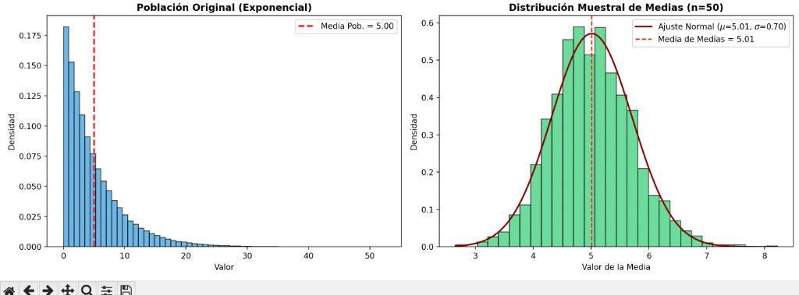

import numpy as np
import matplotlib.pyplot as plt
import seaborn as sns

# Configuración visual
sns.set_theme(style="whitegrid")
plt.rcParams["figure.figsize"] = (12, 8)
np.random.seed(42)

# ==========================================
# 1. PARÁMETROS DE LA POBLACIÓN (Exponencial)
# ==========================================
scale_parameter = 5.0  # Media de la población (mu = 5)
population_size = 100_000

# Generación de la población altamente sesgada a la derecha
population = np.random.exponential(scale=scale_parameter, size=population_size)
pop_mean = np.mean(population)
pop_std = np.std(population)

print(f"Población original | Media: {pop_mean:.2f} | Desv. Estándar: {pop_std:.2f}")

# ==========================================
# 2. SIMULACIÓN DEL TEOREMA CENTRAL DEL LÍMITE
# ==========================================
sample_sizes = [5, 30, 50, 100]
num_samples = 2000

fig, axes = plt.subplots(2, 3, figsize=(16, 10))
axes = axes.flatten()

# Graficar Población Original
sns.histplot(population, kde=True, ax=axes[0], color="skyblue", bins=50)
axes[0].axvline(pop_mean, color="red", linestyle="--", label=f"Media Poblacional ({pop_mean:.2f})")
axes[0].set_title("1. Población Original (Exponencial - Sesgada)")
axes[0].set_xlabel("Valor")
axes[0].set_ylabel("Frecuencia")
axes[0].legend()

# Graficar Distribuciones Muestrales para distintos n
for idx, n in enumerate(sample_sizes, start=1):
    # Extracción de muestras y cálculo de medias
    sample_means = [np.mean(np.random.choice(population, size=n, replace=True)) for _ in range(num_samples)]
    
    mean_of_means = np.mean(sample_means)
    std_of_means = np.std(sample_means)
    theoretical_std = pop_std / np.sqrt(n)
    
    # Histograma con ajuste normal
    sns.histplot(sample_means, kde=True, ax=axes[idx], color="mediumseagreen", stat="density", bins=30)
    
    axes[idx].axvline(mean_of_means, color="red", linestyle="--", label=f"Media de Medias: {mean_of_means:.2f}")
    axes[idx].set_title(f"n = {n} | EE Real: {std_of_means:.2f} (Teórico: {theoretical_std:.2f})")
    axes[idx].set_xlabel("Valor de la Media")
    axes[idx].set_ylabel("Densidad")
    axes[idx].legend()

    

# Ocultar el sexto panel sobrante
fig.delaxes(axes[5])
plt.tight_layout()
plt.show()# 📊 Central Limit Theorem (CLT) Simulation in Python

Demostración práctica del **Teorema Central del Límite (TCL)** utilizando simulaciones de Monte Carlo con Python (`NumPy`, `Matplotlib` y `Seaborn`). 

El objetivo de este proyecto es validar empíricamente cómo la distribución de las medias muestrales de una población altamente asimétrica converge hacia una distribución normal estándar a medida que incrementa el tamaño de la muestra ($n$).

## 🎯 Objetivos del Proyecto
1. Generar una población no normal (Distribución Exponencial con $\mu = 5.0$).
2. Evaluar el comportamiento de las medias muestrales para tamaños de muestra $n \in \{5, 30, 50, 100\}$.
3. Comprobar la reducción del Error Estándar ($\sigma_{\bar{x}} = \frac{\sigma}{\sqrt{n}}$).
4. Conectar el fundamento estadístico con la toma de decisiones en analítica de negocio (A/B Testing e Intervalos de Confianza).

## 🛠️ Tecnologías Utilizadas
* **Lenguaje:** Python 3.10+
* **Librerías:** `numpy`, `matplotlib`, `seaborn`

## 📈 Resultados Visuales
A pesar de que la población origen presenta un sesgo extremo a la derecha, a partir de $n \ge 30$ la distribución de las medias adopta una simetría campaniforme (Normal), demostrando la solidez del TCL en datos del mundo real.

## 🔗 Enlaces de Interés

---

## 🔗 Enlaces de Interés

---

* **Portafolio en Notion:** [Ver caso de estudio documentado](https://massive-partner-85f.notion.site/Caso-de-Estudio-Demostraci-n-Pr-ctica-del-Teorema-Central-del-L-mite-con-Python-3d40b8a57e6080398774c51cb9146bf7?pvs=143)
* **LinkedIn:** [Ver publicación del proyecto](https://lnkd.in/p/eF7DMaGW)
