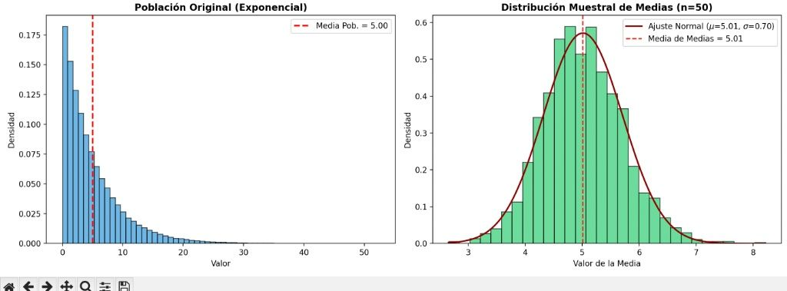

# 📊 Simulación del Teorema Central del Límite con Python

Demostración práctica del **Teorema Central del Límite (TCL)** mediante simulaciones de Monte Carlo con `NumPy`, `Matplotlib` y `Seaborn`.

El objetivo es validar empíricamente cómo la distribución de las medias muestrales de una población muy asimétrica converge hacia una distribución normal a medida que aumenta el tamaño de la muestra (n).

> Proyecto desarrollado en el Máster en Data Science e Inteligencia Artificial de **EBIS Business Techschool**.

---

## 🎯 Objetivos

1. Generar una población no normal (distribución exponencial con μ = 5.0).
2. Evaluar el comportamiento de las medias muestrales para n ∈ {5, 30, 50, 100}.
3. Comprobar la reducción del error estándar: **σx̄ = σ / √n**.
4. Conectar el resultado estadístico con decisiones de negocio (tests A/B e intervalos de confianza).

## 🧪 Metodología

- **Población:** 100.000 observaciones de una distribución exponencial (sesgo positivo extremo).
- **Muestreo:** 2.000 muestras aleatorias para cada tamaño muestral.
- **Métricas:** media de las medias y error estándar real frente al teórico.

## 📈 Resultados



- **Convergencia a la normalidad:** con n = 5 la distribución conserva algo de asimetría; a partir de n ≥ 30 adopta forma de campana.
- **Estabilidad de la media:** la media de las medias se mantiene en torno al valor poblacional (≈ 5.01) en todos los escenarios.
- **Reducción de la varianza:** a mayor n, menor dispersión de las medias, tal y como predice la fórmula del error estándar.

## 💼 Aplicación en negocio

- **Tests A/B fiables:** permite comparar métricas como el ticket medio entre dos grupos sin transformar datos que no son normales.
- **Intervalos de confianza:** facilita estimar rangos de ingresos o conversión con un 95 % o 99 % de confianza.
- **Gestión de outliers:** ayuda a decidir cuándo la media es representativa y cuándo conviene complementarla con la mediana.

## 🛠️ Tecnologías

- Python 3.10+
- NumPy · Matplotlib · Seaborn

## ▶️ Cómo ejecutarlo

```bash
pip install numpy matplotlib seaborn
python clt_simulation.py
```

## 💻 Código principal

```python
import numpy as np
import matplotlib.pyplot as plt
import seaborn as sns

sns.set_theme(style="whitegrid")
np.random.seed(42)

# 1. Población exponencial sesgada
population = np.random.exponential(scale=5.0, size=100_000)
pop_mean, pop_std = np.mean(population), np.std(population)

# 2. Simulación del TCL
sample_sizes = [5, 30, 50, 100]
num_samples = 2000

fig, axes = plt.subplots(2, 3, figsize=(16, 10))
axes = axes.flatten()

sns.histplot(population, kde=True, ax=axes[0], color="skyblue", bins=50)
axes[0].axvline(pop_mean, color="red", linestyle="--")
axes[0].set_title("Población original (exponencial)")

for idx, n in enumerate(sample_sizes, start=1):
    sample_means = [np.mean(np.random.choice(population, size=n)) for _ in range(num_samples)]
    std_of_means = np.std(sample_means)
    theoretical_std = pop_std / np.sqrt(n)

    sns.histplot(sample_means, kde=True, ax=axes[idx], color="mediumseagreen", stat="density", bins=30)
    axes[idx].axvline(np.mean(sample_means), color="red", linestyle="--")
    axes[idx].set_title(f"n = {n} | EE real: {std_of_means:.2f} (teórico: {theoretical_std:.2f})")

fig.delaxes(axes[5])
plt.tight_layout()
plt.show()
```

## 🔗 Enlaces

- **Caso de estudio en Notion:** [Ver documentación](https://massive-partner-85f.notion.site/Caso-de-Estudio-Demostraci-n-Pr-ctica-del-Teorema-Central-del-L-mite-con-Python-3d40b8a57e6080398774c51cb9146bf7)
- **LinkedIn:** [Claudio Abreu Afonso](https://www.linkedin.com/in/claudioabreuafonso/)

---

**Autor:** Claudio Abreu Afonso · Data Analyst Jr.
